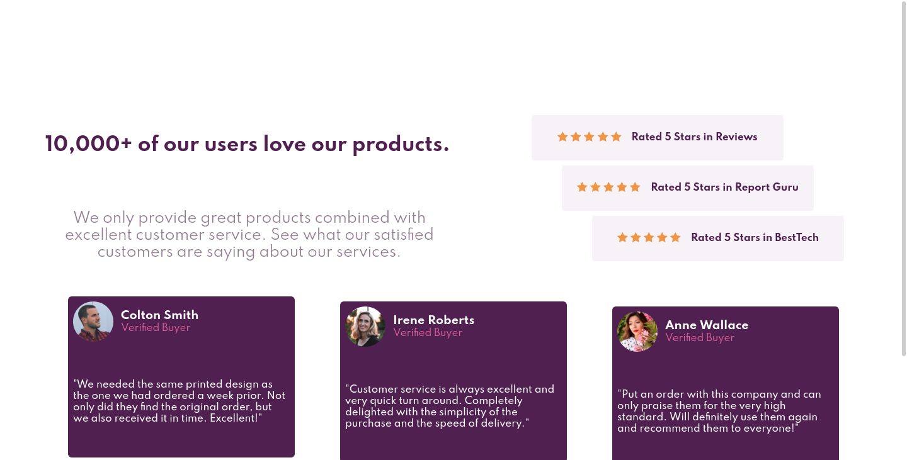

# Frontend Mentor - Social proof section solution

Esta es una solución para el [Social proof section challenge on Frontend Mentor](https://www.frontendmentor.io/challenges/social-proof-section-6e0qTv_bA). Los retos de Frontend Mentor pueden ayudarte a mejorar tus habilidades por medio de crear proyectos reales.

## Tabla de contenidos

- [Información general](#información-general)
  - [El reto](#el-reto)
  - [Screenshot](#screenshot)
  - [Links](#links)
- [Mi proceso](#mi-proceso)
  - [Herramientas utilizadas](#herramientas-utilizadas)
- [Autor](#autor)

## Información general

### El reto

- Ver la disposición correcta dependiendo del tamaño de la pantalla de su dispositivo.

### Screenshot

Mobile

Desktop

### Links
- URL para la solución: [Solution page]()
- URL para probar el sitio: [Github pages]()

## Mi proceso

### Herramientas utilizadas

- HTML5 
- CSS
- Flexbox
- CSS Grid
- Mobile-first workflow

## Autor

- Frontend Mentor - [@Caresle](https://www.frontendmentor.io/profile/Caresle)
- Instagram - [@caresle1](https://instagram.com/caresle1)